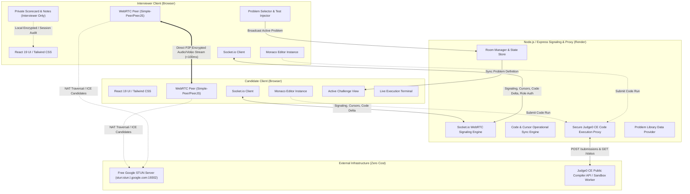
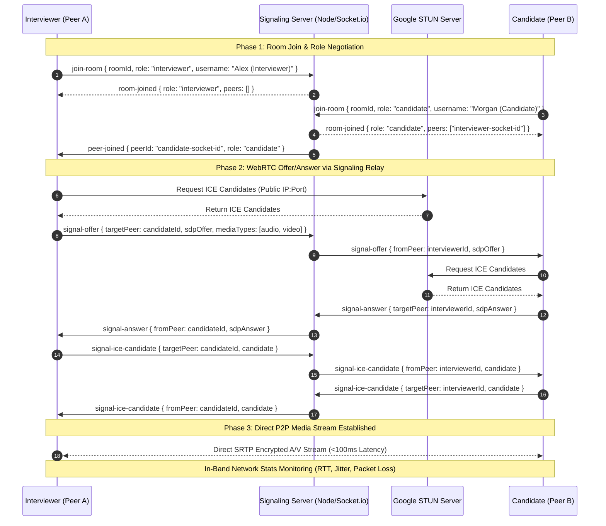
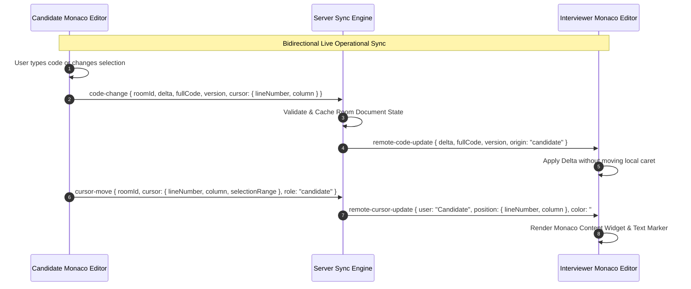
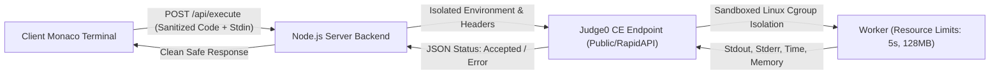
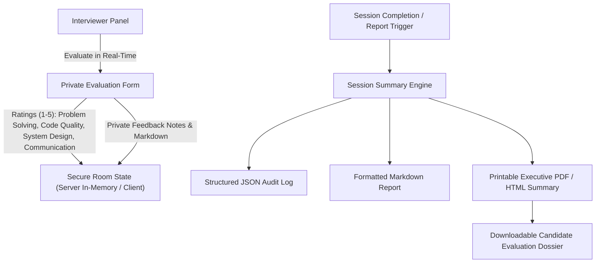

`# Remote Technical Interview Sandbox with WebRTC Audio & Code Run
## System Architecture & Technical Planning Specification

---

### 1. Executive Summary & Architecture Overview

**Remote Technical Interview Sandbox with WebRTC Audio & Code Run** is a high-performance, real-time collaborative coding and technical assessment environment. It is engineered with zero paid server infrastructure dependencies, pairing lightweight Node.js/Socket.io signaling with direct browser-to-browser WebRTC audio/video mesh networking, Monaco Editor operational synchronization, and a secure backend-proxied Judge0 CE execution pipeline.



---

### 2. WebRTC Peer-to-Peer Signaling & Media Handshake

The WebRTC subsystem establishes direct sub-100ms peer connections over UDP/SRTP. Signaling happens over Socket.io using an Offer/Answer/ICE Candidate relay pattern.



---

### 3. Collaborative Code Editor & Cursor Synchronization

Operational synchronization allows simultaneous typing, language switching, and cursor awareness without cursor collisions or cursor jumping:



---

### 4. Judge0 CE Code Execution Pipeline & Security Isolation

To strictly enforce constraint #3 ("Ensure code execution is securely isolated via remote API calls without exposing API keys on the client side"):
1. The client sends `{ languageId, sourceCode, stdin }` to the Node.js backend (`/api/execute`).
2. The Node.js backend validates, sanitizes, and forwards the request to Judge0 CE (using either free public instances or RapidAPI keys stored in backend environment variables).
3. The backend polls until completion (or uses callback where supported) and returns formatted `{ stdout, stderr, compile_output, time, memory, status }`.
4. If the remote service is temporarily rate-limited or offline, the backend includes an automated fallback execution runner for Python and JavaScript, ensuring unbroken interview experience.



---

### 5. Private Interviewer Scorecard & Audit Report Flow



---

### 6. Component Hierarchy (React 19 Frontend)

```
App.tsx
├── Navbar
│   ├── RoomStatusBadge (Connection, Latency RTT, Role)
│   ├── LanguageSelector (Python, JavaScript, C++, Java)
│   ├── QuickActionToolbar (Run Code, Reset Code, Invite Link, End Session)
│   └── AudioVideoControls (Mic, Cam, ScreenShare, Media Settings)
├── WorkspaceGrid (Resizable Split Panels)
│   ├── LeftPanel (Context & Challenges)
│   │   ├── ProblemStatementCard (Title, Tags, Difficulty, Examples, Constraints)
│   │   ├── InterviewerChallengePicker (Search, Filter, Inject to Room) [Interviewer Only]
│   │   └── InterviewerScorecardPanel (Ratings, Notes, Rubric) [Interviewer Only]
│   ├── CenterPanel (Collaborative Code Environment)
│   │   ├── EditorHeader (Active Users, Typing Indicators, Sync Status)
│   │   ├── MonacoCodeEditor (Collaborative Syntax Highlight, Remote Cursors)
│   │   └── ExecutionTerminal (Tabs: Console Output, Custom Stdin, Test Case Runner)
│   └── RightPanel (Peer-to-Peer AV & Real-Time Chat)
│       ├── VideoGrid (Interviewer Stream + Candidate Stream + Screen Share)
│       ├── AudioMeter / NetworkQualityIndicator
│       └── ChatBox (Text Chat, Code Snippets, System Notifications)
└── SessionReportModal (Generated Post-Interview Summary, Metrics, Export Actions)
```

---

### 7. Non-Functional Requirements & Performance Budgets

| Metric | Target Budget | Strategy |
| :--- | :--- | :--- |
| **WebRTC Media Latency** | < 100 ms | Direct P2P SRTP connection via Google STUN; low-overhead Opus/VP8 codecs |
| **Signaling Latency** | < 50 ms | Lightweight binary/JSON Socket.io payloads over WebSocket |
| **Editor Sync Jitter** | Zero jumping | Differential debounced delta broadcast with client-side cursor lock |
| **Execution Timeout** | 5 seconds max | Backend Judge0 proxy enforcement with standard input timeout limit |
| **Server Cost** | $0.00 | Free Render Web Service + Free Vercel Static Hosting + Free STUN + Free Judge0 CE |
| **Security** | Zero Client Secrets | All API keys and environment variables strictly encapsulated in backend proxy |
